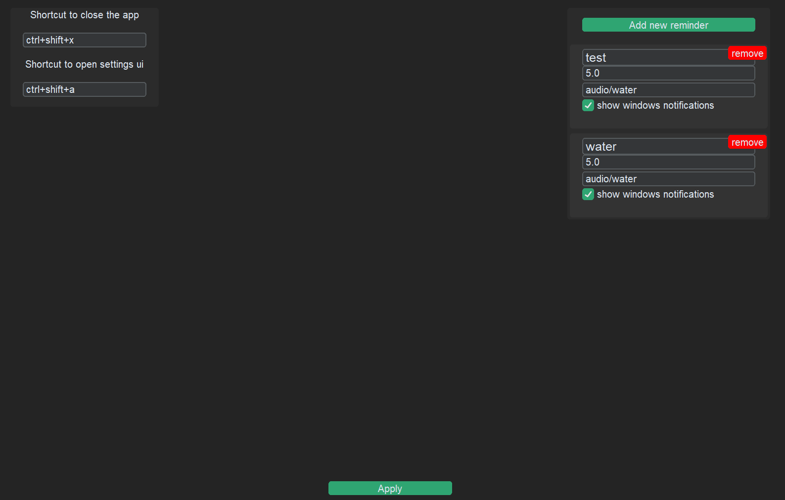

# Common reminders
## A simple app to improve your habits

This project aims to be as **simple** as it gets for user and allow you to:

- Modify settings using **simple UI** that you open by **custom** shortcut
- Set sound alerts so you always remember to stay hydrated! *Yeah it's hard*
- Apply **custom** sounds for whatever you need so you know exactly when you need to do push-ups!
- Configure to show toast notifications on windows 

## Installation
### compile your own exe (recommended but harder)
0. clone this repo
1. make sure you have installed python
3. open in commandline directory where you have cloned this repo and type:
`` pip install  windows_toasts  customtkinter cx_Freeze
4. create exe file using cxfreeze:
`` cxfreeze-quickstart 
- type Project name - Common reminders
- Version - whatever
- Description - whatever
- file - main.py
- file name: Common reminders
- app type- G
- press enter 
- run this now - y

 And you have a new exe file!
 5. (optional) put shortcut to exe file to autostart:
- press win+R
- type C:\ProgramData\Microsoft\Windows\Start Menu\Programs\StartUp 
- create shortcut
### download exe (easier)
1. download from [release](https://github.com/LeaveMyAlpacaAlone/commonReminders/releases/)
2. un compress it
3. (optional) put shortcut to exe file to autostart:
- press win+R
- type C:\ProgramData\Microsoft\Windows\Start Menu\Programs\StartUp 
- create shortcut

## how to change settings?
1. make sure that application is opened - it won't show up but you should hear test sounds
2. press shortcut to open ui (default is ctrl+shift+a)
App window might be hidden on your task bar! 
4. change settings inside application window
5. Press apply button
settings should be saved inside special save file
## contribution guide

### I've encountered a bug!
write a [issue](https://www.youtube.com/watch?v=6HWw7rhwvtY) about it and describe how to replicate it so i can fix it sooner
### There is a really nice feature that can be added
write a [issue](https://www.youtube.com/watch?v=6HWw7rhwvtY) about it and describe why should it be added. If it seams boring, unclear or rarely used it might be added later or never!
### There is a nice feature that i know and want to add
<b>great! thanks in advance!
try to split [pul requests](https://www.youtube.com/watch?v=8lGpZkjnkt4) to smaller parts and clearly label what they are doing and why.
